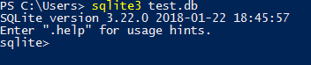
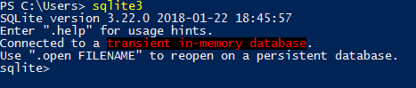
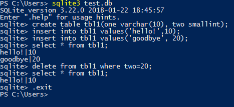

# SQLite Practise

SQLite is a self-contained, high-reliability, embedded, full-featured, public-domain, SQL database engine. SQLite is the most used database engine in the world.

Official website: http://www.sqlite.org

## Install SQLite

### Windows

1. Manually  
    Go to SQLite [download](http://www.sqlite.org/download.html) page, download both dll and tools, extract them into a folder.

2. Using Chocolatey  
   `choco install sqlite`

### Mac

`brew install sqlite`

## Using SQLite CLI

The SQLite project provides a simple command-line program named sqlite3 (or sqlite3.exe on Windows) that allows the user to manually enter and execute SQL statements against an SQLite database.

http://www.sqlite.org/cli.html

### Create a new Database

1. Typing "sqlite3" at the command prompt, optionally followed by the name of the file that holds the SQLite database. If the named file does not exist, a new database file with the given name will be created automatically.  
`sqlite3 test.db`  
After that, you'll be prompt to enter SQL statements.  

    > If you exit the sqlite3 without creating any tables, the database file will not be created. You can call `.databases` command in the command prompt to create an empty database file: `sqlite3 test.db ".databases"`

2. If no database file is specified on the command-line, a temporary in-memory database is created, and will be deleted when the "sqlite3" program exits.  

### CRUD in SQLite CLI

## System.Data.SQLite

System.Data.SQLite is an ADO.NET provider for SQLite.

Official website: http://system.data.sqlite.org

Install from [nuget.org](https://www.nuget.org/packages/System.Data.SQLite.Core/) :
`Install-Package System.Data.SQLite.Core -Version 1.0.108`

> Be careful that the package `System.Data.SQLite` is a collection of below packages:
> 1. System.Data.SQLite.Core
> 2. System.Data.SQLite.Linq
> 3. System.Data.SQLite.EF6

## Reference

* [SQLite connection strings](https://www.connectionstrings.com/sqlite/)
* [Create empty sqlite db from command line](https://stackoverflow.com/questions/20155693/create-empty-sqlite-db-from-command-line)
* [Getting started with SQLite in C#](https://blog.tigrangasparian.com/2012/02/09/getting-started-with-sqlite-in-c-part-one/)